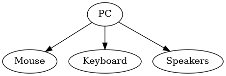
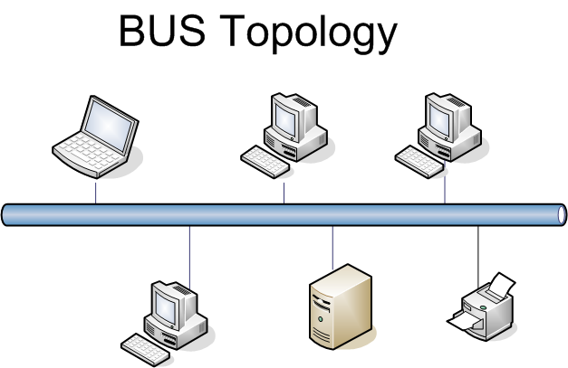
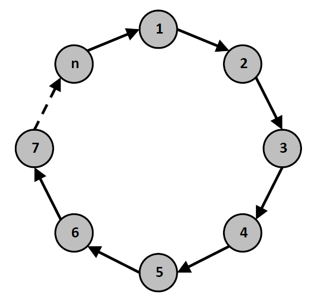
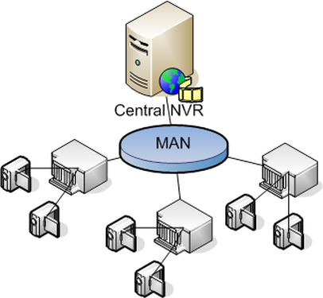

# Introduction to Computer Networks

## Introduction 
A computer network or data network, is a digital telecommunication network which allows nodes to share resources. In computer networks, networked computing devices exchange data with each other using datalink. The connection b/w nodes are established using either cable media or wireless media.

**Objectives**

* Transfer data from one machine to another.
* Facilitate sharing of data
* Facilitate access of remote information

**Application**

* World Wide Web
* Online Social Networks
* Email

## Network Hardware 
There are two types of transmission technology

1. Broadcast links
2. Point to Point Links

Broadcast networks have single communication channel that is shared by all machines on network packets (short messages** sent by any machine are recieved by all others. Address fields with the packet specifies intended recipient. Upon recieving machine checks address field. 

If the packet is intended for recieving, it processes the packet else ignores it.

**Broadcasting** : Possibility of addressing packet to all destinations by using special code in address field. It is recieved and processed by every machine on the network.

**Multicasting** : Source node sends message to some subset of other nodes, but not all of them.

**Unicasting** : Point to Point transmission with one sender and one reciever.

## Types of Networks
Classification of networks based on scale and distance

| Distance  | Located in Same | Example  |
|-----------|-----------------|----------|
| 1 m       | Square Meter    | PAN      |
| 10 m      | Room            | LAN      |
| 100 m     | Building        | LAN      |
| 1 Km      | Campus          | LAN      |
| 10 Km     | City            | MAN      |
| 100 Km    | Country         | WAN      |
| 1000 Km   | Contitent       | WAN      |
| 10,000 Km | Planet          | Internet |

### Personal Area Network (PAN)
PAN are mainly set up for single person use. It consititues of basic devices interacting with a master device.

* Uses master slave paradigm
* PC acts as the master connecting the keyboard, mouse as slaves. 

{#fig:panconnection width=50%}

### LAN 
Local Area Networks provide network access within closed areas such as single buildings. They are used to connect local workstations in company offices and factories to interconnect local devices and to exchange information.

LAN's are distinguished from other kinds of networks by three characteristics

1. Size
2. Transmission Technology
3. Topology

LAN's are restricted in size to single buildings. They are also called enterprise network. 

Here the network may be arranged in any one of the following topologies.

**Bus Topology** : Every machine is connected to all other machines through a single bus line. Only a single machine can transmit at a time. When one machine is transmitting all other machines should only be listening.

{#fig:bustopology width=50%}

**Ring Topology** : A ring network is a network topology in which each node connects to exactly two other nodes, forming a single continuous pathway for signals through each node - a ring. Data travels from node to node, with each node along the way handling every packet.

{#fig:bustopology width=50%}

### MAN
A metropolitan area network (MAN) is a computer network that interconnects users with computer resources in a geographic area or region larger than that covered by even a large local area network (LAN) but smaller than the area covered by a wide area network (WAN). 

{#fig:mannetwork width=30%}

It has a range of 5 to 50 kilometres.

### WAN
A wide area network (WAN) is a network that exists over a large-scale geographical area. A WAN connects different smaller networks, including local area networks (LANs) and metro area networks (MANs). This ensures that computers and users in one location can communicate with computers and users in other locations.

### Internetwork
Collection of Interconnected networks is called an Internetwork or Internet.

Gateways are machines that make connections between two or more networks, and provide neccesary transalation both in terms of hardware and software.

## Network Software
The first computer networks were designed with the hardware as the main concern and the software as an afterthought. This strategy no longer works. Network software is now highly structured.

### Protocols
In computer networks, communication occurs between entities in different systems. An entity is anything capable of sending or receiving information. However, two entities cannot simply send bit streams to each other and expect to be understood. For communication to occur, the entities must agree on a protocol. 

A protocol is a set of rules that govern data communications. A protocol defines what is communicated, how it is communicated, and when it is communicated. The key elements of a protocol are syntax, semantics, and timing.

### Protocol Hierarchies
To reduce their design complexity, most networks are organized as a stack of layers or levels, each one built upon the one below it. The number of layers, the name of each layer, the contents of each layer, and the function of each layer differ from network to network. 

The purpose of each layer is to offer certain services to the higher layers, shielding those layers from the details of how the offered services are actually implemented. layer N on one machine carries on a conversation with layer N on another machine. The rules and conventions used in this conversation are collectively known as the layer N protocol. 

{#fig:layerednetwork width=70%}

In order to understand how the actual communication is achieved between two remote hosts connected to the same network, a general network diagram {@fig:layerednetwork} is shown above divided into a series of layers. As it seen later on the on the course the actual number as well as their function of each layer differs from network to network.

Each layer passes data and control information to the layer below It. As soon as the data are collected form the next layer, some functions are performed there and the data are upgraded and passed to the next layer. This continues until the lowest layer is reached. Actual communication occurs when the information passes layer 1 and reaches the Physical medium. This is shown with the solid lines on the diagram. Theoretically layer N on one machine maintains a conversation with the same layer in the other machine. The way this conversation is achieved is by the protocol of each layer. 

Protocol is collection of rules and conventions as agreement between the communication parties on how communication is to proceed. The latter is known as virtual communication and is indicated with the dotted lines on the diagram above.

layer N of one machine carries a conversion with the layer N of another machine. The rules and conversion are collectively known as protocol. Entities comprising layers of different machine is called peer process. 

The data and information is passed by each layer to the lower layer. When the lower layer is reached it is passed to the physical medium which actual communication occurs. Between the pair of adjacent layer their lies the interface. The interface defines which type of services the lower layer offers to the upper layer.

Protocols are together called **Protocol Stack** or set of protocols.

As far as the above diagram is concerned another important issue to be discussed is the interface between each layer. It defines the services and operation the lower layer offers to the one above It. When a network is built decisions are made to decide how many layers to be included and what each layer should do. So each layer performs a different function and as a result the amount of information past from layer to layer is minimized. 

### Design Issues for a layer
